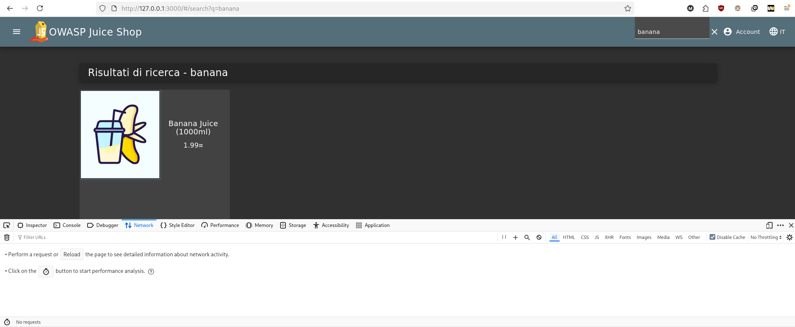
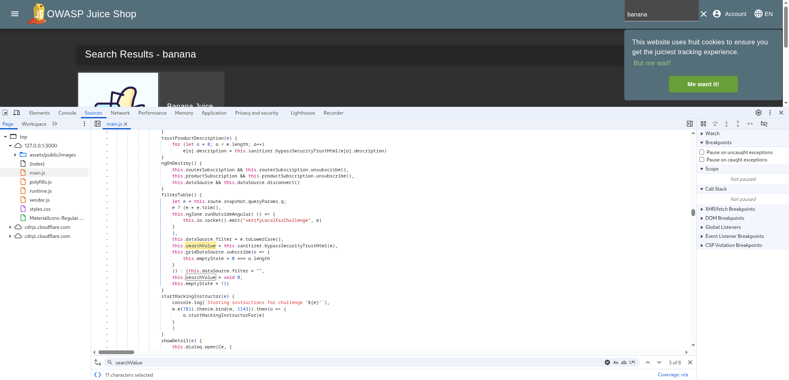
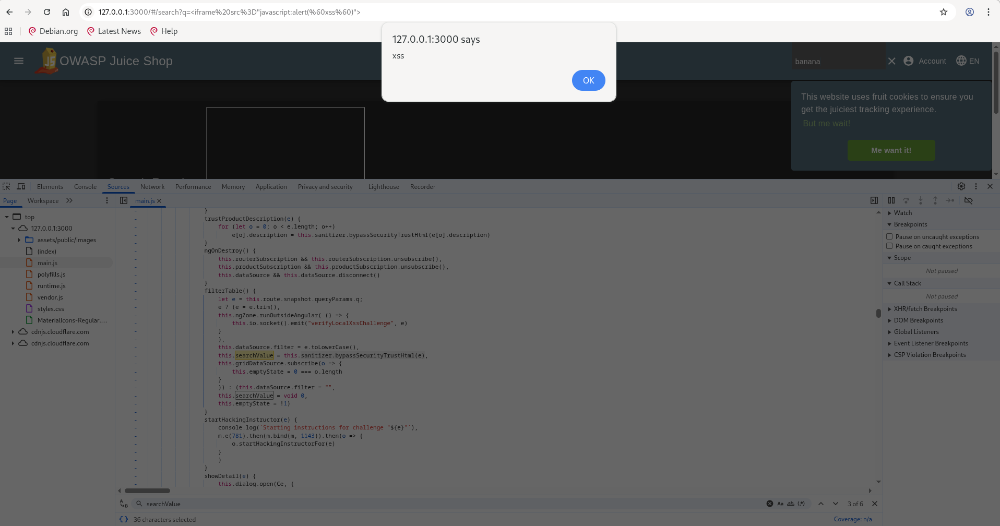
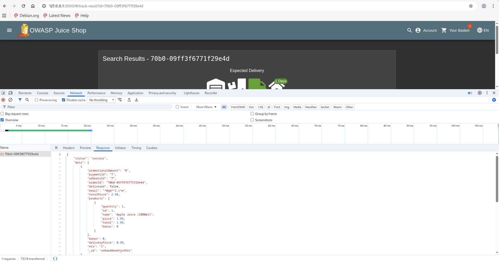

# XSS Vulnerabilities

In this report, the OWASP Juice Shop webapp is used to showcase the exploitation of two XSS vulnerabilities.

## Tools

- OWASP Juice Shop (running from Docker image) v19.0.0
- Browser with an inspection mode (using Firefox)

## Challenge #1. DOM XSS Attack

> **Description**: Execute a DOM XSS attack by crafting a malicious link that runs a script without alerting the server

### Preliminary steps

1. Have Juice Shop running

### Discovery

1. Activate inspection mode and navigate to the Network tab
2. Search for an item on the site
3. 
4. There are two key aspects to consider for a potential DOM XSS vulnerability:
   1. The search operation does not trigger a server request (processing is entirely client-side)
   2. The search term is rendered directly into the page (a potential sink)
5. Open the Inspector tab and locate where the search text is displayed, then identify the element ID `searchValue`
6. Search for this ID in the JavaScript code to identify the vulnerability
7. 
8. Notice the function `sanitizer.bypassSecurityTrustHtml(e)` — this indicates improper input handling

> The web application is vulnerable to DOM-XSS due to missing sanitization of user input

### Exploitation

Click the following malicious link to trigger the XSS attack:

``` script
http://127.0.0.1:3000/#/search?q=<iframe src="javascript:alert(`xss`)">
```



## Challenge #2. Reflected XSS Attack

> **Description**: Execute a Reflected XSS attack by crafting a malicious link that runs a script when the application reflects the input back into the page.

### Preliminary steps

1. Have Juice Shop running
2. Have an account
3. Place an order

### Discovery

1. After placing an order, go to Order History
2. Open the Inspector and switch to the Network tab
3. Click "Track" on the order you placed
4. Observe the request that retrieves the order information
5. 
6. Findings:
   1. The order id is passed in the URL
   2. The id returned by the server is rendered into the page (a reflected sink)
7. The parameter retrieved from the response is injected into the page without sanitization; repeat the inspection to locate exactly where the value is written

### Exploitation

Click the following malicious link to trigger the XSS attack (URL-encoded):

``` script
http://127.0.0.1:3000/#/track-result?id=<iframe%20src%3D"javascript:alert(%60xss%60)">
```

> **Observation:** The victim does not need to be logged in for the attack to succeed.
> **Observation:** This indicates the application does not properly restrict which users can view other users' delivery information.

### Remediation (brief)

- Validate and sanitize input on both client and server sides.
- Do not insert untrusted data using `innerHTML` or similar APIs; use safe text APIs or proper output encoding.
- Implement authorization checks to ensure users can only access their own order information.
