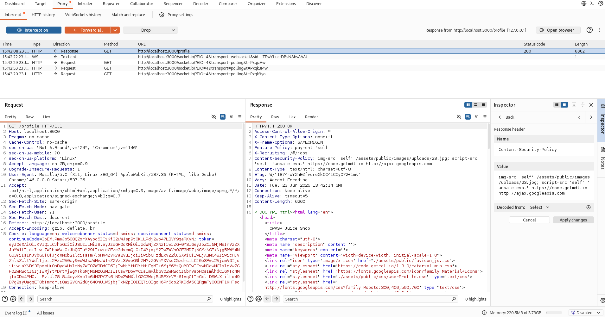
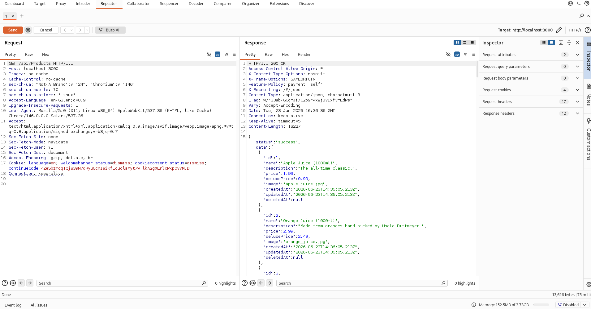
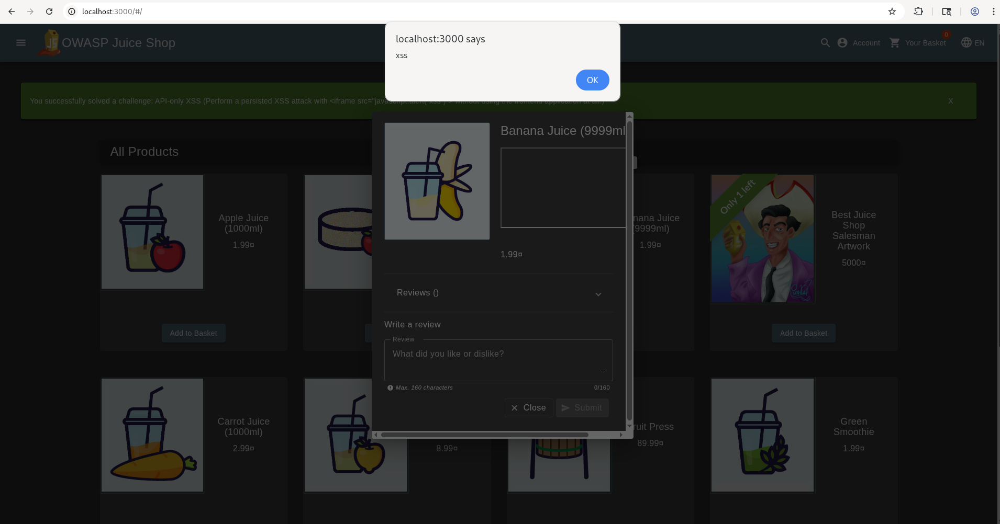

# XSS Vulnerabilities EXTRA

This report demonstrates two stored XSS vulnerabilities in the OWASP Juice Shop web application.

## Tools

- OWASP Juice Shop (Docker image) v19.0.0
- Firefox with developer tools
- Burp Suite

## Challenge #1: CSP Bypass and Stored XSS

> **Description**: Exploit a stored XSS vulnerability by bypassing a Content Security Policy via a crafted image URL.

### Preliminary steps

1. Start OWASP Juice Shop.
2. Log in with a valid account.

### Discovery

1. Open browser developer tools and switch to the Network tab.
2. Navigate to the user profile page and inspect the response headers.
3. Observe the `Content-Security-Policy` header and confirm it is applied to the profile page.
4. 
5. The profile page allows an attacker-controlled image URL and a username field.
6. The image URL input can be used to modify the active CSP policy, while the username field is rendered in the page with insufficient sanitization.

> The application is vulnerable because the attacker can force a relaxed CSP and inject a script payload into a stored field.

### Exploitation

1. In the profile image URL field, submit a URL that alters the `script-src` directive:

```text
http://test.png; script-src 'unsafe-inline' 'self' 'unsafe-eval'
```

2. In the username field, submit a payload that survives server-side sanitization:

```text
<<script>ascript>alert(`xss`)</script>
```

3. Save the profile and reload the page.
4. The injected payload is rendered as:

```html
<script>alert('xss')</script>
```

> The server strips invalid characters but preserves the injected script tag, which executes when the profile page loads.

### Impact

- Stored XSS can be used to execute arbitrary JavaScript in the context of a victim's browser.
- The CSP bypass allows the attacker to defeat client-side protections that would otherwise block inline script execution.

### Remediation

- Do not allow user-controlled input inside security policy headers.
- Enforce a strict CSP that cannot be modified by untrusted data.
- Sanitize or encode values before rendering them into the page.
- Restrict profile fields so they cannot inject active content.

## Challenge #2: API-only Stored XSS

> **Description**: Exploit a stored XSS vulnerability by updating a product description through an API endpoint.

### Preliminary steps

1. Start OWASP Juice Shop.
2. Open Burp Suite and intercept the API request.

### Discovery

1. Enable browser developer tools and inspect API traffic.
2. Find the `api/Products` endpoints in the application JavaScript.
3. Confirm the PUT endpoint is accessible and accepts product updates.
4. Explore `api/Products/6` to verify the expected product JSON structure.
5. 
6. The product description is rendered on the product page without proper sanitization.

> The API endpoint allows stored XSS by accepting HTML content inside the product description.

### Exploitation

1. Intercept a request to `api/Products` and send it to the repeater.
2. Use the `PUT /api/Products/6` endpoint.
3. Set `Content-Type: application/json`.
4. Send the following JSON payload:

```json
{
  "name": "Banana Juice (9999ml)",
  "description": "<iframe src=\"javascript:alert(`xss`)\"></iframe>"
}
```

5. Reload or visit the updated product page.
6. The product description executes the injected JavaScript when the page renders.
7. 

### Impact

- Attackers can store malicious HTML in product content.
- Any visitor who loads the product page may execute the injected script.
- This can lead to session theft, defacement, or further exploitation.

### Remediation

- Validate and sanitize all API input on the server side.
- Block HTML or JavaScript content in fields that are intended to store plain text.
- Restrict product update endpoints to authorized administrator users only.
- Encode user-controlled data before rendering it in HTML contexts.
